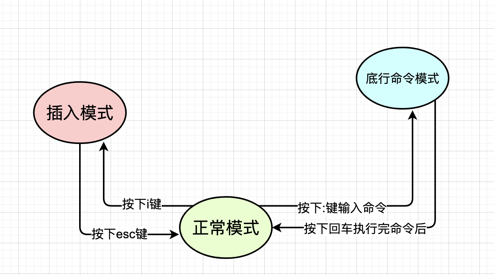

# Vim 教程

## 基本操作

shell环境中的命令

| 命令 | 作用 |
| ---- | ---- |
| cd   | 改变文件夹 |
| pwd  | 显示当前文件夹 |
| ls   | 列出当前文件夹下的内容 |

vim xxx.py
i 进入编辑模式  
esc 退出编辑模式  
 :wq 保存并退出(shift+;)  
 :write 保存 :quit 退出 :q! 不保存退出

:register 查看寄存器内容

yy 复制当前行  
p 粘贴//paste  
hl左右移动  
kj上下移动

| 按键 | 作用 |
| ---- | ---- |
| yy   | 复制光标行代码 到剪贴板 |
| p    | 粘贴剪贴板中的内容 |
| i    | 切换到 插入模式 |
| h j k l | 左 下 上 右 移动 |

| 命令 | 作用 |
| ---- | ---- |
| :reg | 查看寄存器状态 |
| :w   | 保存当前文件 |
| :q   | 退出当前文件 |
| :wq  | 保存并退出当前文件 |

: 执行vim本身的命令
:! 执行外部 命令

- 外部 指的是 vim应用外部
- 也就是 shell环境中的命令

百分号%
可以代表当前正在编辑的 文件缓存
:w|!python3 %
| 的意思是 依次执行
先执行 前面的w
再执行 后边!python3 %

ctrl + f
向前翻页
f 意味着forward
ctrl + b
向后翻页
b 意味着backward

gg
跳转回到 第1行
重新开始
大写G
跳转到 最后1行

按一下 u

撤销一步
u 代表undo
代表着撤销

ctrl+r可以重做
r代表
redo 重做
取消 撤销操作

dgg
从当前行
删除到第一行
dG
从当前行
删除到 最后一行

ggdG
gg
跳转到第一行
当前光标 第一行
dG
从当前行(第一行)
删除到 最后一行

| 命令 | 作用 |
| ---- | ---- |
| yy   | 复制光标所在行代码 到剪贴板 |
| p    | 粘贴 剪贴板中的内容 |
| 9999p| 将剪贴板中的代码粘贴9999次 |

| 命令 | 作用 |
| ---- | ---- |
| gg   | 第一行 |
| G    | 最后一行 |
| 123G | 第123行 |

在vim环境中
依次按下"+
底行状态栏 会有显示+ 意味着使用 系统剪贴板
按下p
完成粘贴

输入 :99,107s/8/❤/g
: 进入底行命令模式
99,107 行的范围内
s 替换 substitute
8 为 待替换的源
❤ 为 替换为的目标
g 为 global全局替换
(行内不止一次替换)
